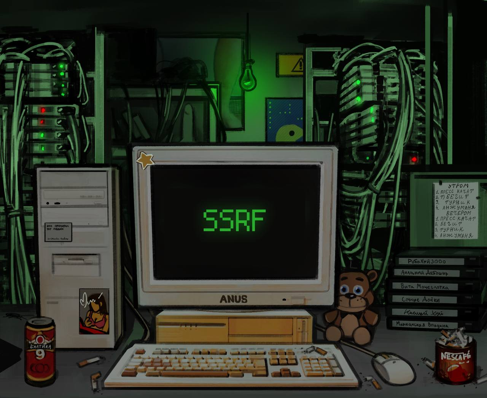

# cibsecurity
`2024-03-14`

* https://thehackernews.com/2024/03/fortinet-warns-of-severe-sqli.html

<blockquote>
🖋️ Fortinet Warns of Severe SQLi Vulnerability in FortiClientEMS Software 🖋️

Fortinet has warned of a critical security flaw impacting its FortiClientEMS software that could allow attackers to achieve code execution on affected systems. &quot;An improper neutralization of special elements used in an SQL Command 'SQL Injection' vulnerability CWE89 in FortiClientEMS may allow an unauthenticated attacker to execute unauthorized code or commands via specifically crafted.

📖 Read more.

🔗 Via &quot;The Hacker News&quot;

----------
👁️ Seen on @cibsecurity
</blockquote>

---

# Leakers_squad
`2024-03-13`

* https://t.me/leakers_Squad/1841

<blockquote>
✅ Complete Bug Bounty tool List 📌

dnscan https://github.com/rbsec/dnscan

Knockpy https://github.com/guelfoweb/knock

Sublist3r https://github.com/aboul3la/Sublist3r

massdns https://github.com/blechschmidt/massdns

nmap https://nmap.org

masscan https://github.com/robertdavidgraham/masscan

EyeWitness https://github.com/ChrisTruncer/EyeWitness

DirBuster https://sourceforge.net/projects/dirbuster/

dirsearch https://github.com/maurosoria/dirsearch

Gitrob https://github.com/michenriksen/gitrob

git-secrets https://github.com/awslabs/git-secrets

sandcastle https://github.com/yasinS/sandcastle

bucket_finder https://digi.ninja/projects/bucket_finder.php

GoogD0rker https://github.com/ZephrFish/GoogD0rker/

Wayback Machine https://web.archive.org

waybackurls https://gist.github.com/mhmdiaa/adf6bff70142e5091792841d4b372050 Sn1per https://github.com/1N3/Sn1per/

XRay https://github.com/evilsocket/xray

wfuzz https://github.com/xmendez/wfuzz/

patator https://github.com/lanjelot/patator

datasploit https://github.com/DataSploit/datasploit

hydra https://github.com/vanhauser-thc/thc-hydra

changeme https://github.com/ztgrace/changeme

MobSF https://github.com/MobSF/Mobile-Security-Framework-MobSF/ Apktool https://github.com/iBotPeaches/Apktool

dex2jar https://sourceforge.net/projects/dex2jar/

sqlmap http://sqlmap.org/

oxml_xxe https://github.com/BuffaloWill/oxml_xxe/ @cyb3rhunt3r

XXE Injector https://github.com/enjoiz/XXEinjector

The JSON Web Token Toolkit https://github.com/ticarpi/jwt_tool

ground-control https://github.com/jobertabma/ground-control

ssrfDetector https://github.com/JacobReynolds/ssrfDetector

LFISuit https://github.com/D35m0nd142/LFISuite

GitTools https://github.com/internetwache/GitTools

dvcs-ripper https://github.com/kost/dvcs-ripper

tko-subs https://github.com/anshumanbh/tko-subs

HostileSubBruteforcer https://github.com/nahamsec/HostileSubBruteforcer Race the Web https://github.com/insp3ctre/race-the-web

ysoserial https://github.com/GoSecure/ysoserial

PHPGGC https://github.com/ambionics/phpggc

CORStest https://github.com/RUB-NDS/CORStest

retire-js https://github.com/RetireJS/retire.js

getsploit https://github.com/vulnersCom/getsploit

Findsploit https://github.com/1N3/Findsploit

bfac https://github.com/mazen160/bfac

WPScan https://wpscan.org/

CMSMap https://github.com/Dionach/CMSmap

Amass https://github.com/OWASP/Amass

By @TheGodEye

👺𝗠𝗔𝗞𝗘 @TheGodEye✅️ 𝗔𝗗𝗠𝗜𝗡 𝗜𝗡 𝗬𝗢𝗨𝗥 𝗖𝗛𝗔𝗡𝗡𝗘𝗟 𝗙𝗢𝗥 𝗔𝗠𝗔𝗭𝗜𝗡𝗚 𝗣𝗢𝗦𝗧𝗦 𝗧𝗛𝗔𝗧 𝗛𝗘𝗟𝗣𝗦 𝗧𝗢 🖥𝗚𝗥𝗢𝗪 𝗬𝗢𝗨𝗥 𝗖𝗛𝗔𝗡𝗡𝗘𝗟 𝟭𝟬𝟭%⭐️ 
🫥🫥🫥🫥🫥🫥🫥🫥
🔻Share and support us🔻

If you want to report any copyright violation, please write to us at  @Leakers_squad_bot and we will ensure to remove that post within 48 hours
Read this
</blockquote>

<table><tr><td><b>→</b><a href="https://github.com/rbsec/dnscan">
https://github.com/rbsec/dnscan
</a>
<blockquote>
Contribute to rbsec/dnscan development by creating an account on GitHub.
</blockquote>
</td></tr></table>

---

# it_secur
`2024-03-12`

* https://securelist.ru/top-10-web-app-vulnerabilities/109215/#1-nedostatki-kontrolya-dostupa
* https://securelist.ru/top-10-web-app-vulnerabilities/109215/#2-raskrytie-chuvstvitelnoj-informacii
* https://securelist.ru/top-10-web-app-vulnerabilities/109215/#3-poddelka-mezhservernyx-zaprosov-ssrf
* https://securelist.ru/top-10-web-app-vulnerabilities/109215/#4-vnedrenie-operatorov-sql
* https://securelist.ru/top-10-web-app-vulnerabilities/109215/#5-mezhsajtovoe-vypolnenie-scenariev-xss
* https://securelist.ru/top-10-web-app-vulnerabilities/109215/#6-nedostatki-autentifikacii
* https://securelist.ru/top-10-web-app-vulnerabilities/109215/#7-nebezopasnaya-konfiguraciya
* https://securelist.ru/top-10-web-app-vulnerabilities/109215/#8-nedostatochnaya-zashhita-ot-perebora-parolya
* https://securelist.ru/top-10-web-app-vulnerabilities/109215/#9-slabyj-parol-polzovatelya
* https://securelist.ru/top-10-web-app-vulnerabilities/109215/#10-ispolzovanie-komponentov-s-izvestnymi-uyazvimostyami

<blockquote>
🌍 ТОР10 уязвимостей в веб-приложениях в 2021–2023 годах.

•  Эксперты Лаборатории Касперского составили рейтинг уязвимостей в веб-приложениях, отражающий взгляд на этот вопрос через призму многолетнего опыта в деле анализа защищенности веб-приложений.

•  Недостатки контроля доступа;
•  Раскрытие чувствительной информации;
•  Подделка межсерверных запросов (SSRF);
•  Внедрение операторов SQL;
•  Межсайтовое выполнение сценариев (XSS);
•  Недостатки аутентификации;
•  Небезопасная конфигурация;
•  Недостаточная защита от перебора пароля;
•  Слабый пароль пользователя;
•  Использование компонентов с известными уязвимостями.

&#35;Отчет &#35;Web
</blockquote>

---

# defcon_news
`2024-03-11`

<blockquote>
CVE-2023-49785 SSRF in NextChat: An AI Chatbot That Lets You Talk to Anyone You Want To
https://old.reddit.com/r/netsec/comments/1bc3plz/cve202349785_ssrf_in_nextchat_an_ai_chatbot_that/
</blockquote>

<table><tr><td><b>→</b><a href="https://old.reddit.com/r/netsec/comments/1bc3plz/cve202349785_ssrf_in_nextchat_an_ai_chatbot_that/">
https://old.reddit.com/r/netsec/comments/1bc3plz/cve202349785_ssrf_in_nextchat_an_ai_chatbot_that/
</a>
<blockquote>
Explore this post and more from the netsec community
</blockquote>
</td></tr></table>

---

# defcon_news
`2024-03-06`

<blockquote>
Code injection on Android without ptrace
https://old.reddit.com/r/netsec/comments/1b86jiq/code_injection_on_android_without_ptrace/
</blockquote>

<table><tr><td><b>→</b><a href="https://old.reddit.com/r/netsec/comments/1b86jiq/code_injection_on_android_without_ptrace/">
https://old.reddit.com/r/netsec/comments/1b86jiq/code_injection_on_android_without_ptrace/
</a>
<blockquote>
Posted by ihavelotsofspac - 1 vote and no comments
</blockquote>
</td></tr></table>

---

# sysadm_in_channel
`2024-03-06`

<blockquote>
/ VMware ESXi, Workstation, and Fusion contain a use-after-free vulnerability (Critical)

A malicious actor with local administrative privileges on a virtual machine may exploit this issue to execute code as the virtual machine's VMX process running on the host..:

https://www.vmware.com/security/advisories/VMSA-2024-0006.html
</blockquote>

<table><tr><td><b>→</b><a href="https://www.vmware.com/security/advisories/VMSA-2024-0006.html">
https://www.vmware.com/security/advisories/VMSA-2024-0006.html
</a>
<blockquote>
VMware ESXi, Workstation, and Fusion updates address multiple security vulnerabilities (CVE-2024-22252, CVE-2024-22253, CVE-2024-22254, CVE-2024-22255)
</blockquote>
</td></tr></table>

---

# it_secur
`2024-03-05`

* https://blog.devsecopsguides.com/attacking-ios#heading-launching-the-debugserver-on-the-device
* https://blog.devsecopsguides.com/attacking-ios#heading-dumping-application-memory
* https://blog.devsecopsguides.com/attacking-ios#heading-inspecting-binaries
* https://blog.devsecopsguides.com/attacking-ios#heading-defeating-certificate-pinning
* https://blog.devsecopsguides.com/attacking-ios#heading-basic-authentication
* https://blog.devsecopsguides.com/attacking-ios#heading-tls-certificate-pinning
* https://blog.devsecopsguides.com/attacking-ios#heading-nsurlsession
* https://blog.devsecopsguides.com/attacking-ios#heading-risks-of-third-party-networking-apis
* https://blog.devsecopsguides.com/attacking-ios#heading-url-schemes-and-the-openurl-method
* https://blog.devsecopsguides.com/attacking-ios#heading-universal-links
* https://blog.devsecopsguides.com/attacking-ios#heading-using-and-abusing-uiwebviews
* https://blog.devsecopsguides.com/attacking-ios#heading-wkwebview
* https://blog.devsecopsguides.com/attacking-ios#heading-nslog-leakage
* https://blog.devsecopsguides.com/attacking-ios#heading-keylogging-and-the-autocorrection-database
* https://blog.devsecopsguides.com/attacking-ios#heading-dealing-with-sensitive-data-in-snapshots
* https://blog.devsecopsguides.com/attacking-ios#heading-leaks-due-to-state-preservation
* https://blog.devsecopsguides.com/attacking-ios#heading-format-strings
* https://blog.devsecopsguides.com/attacking-ios#heading-buffer-overflows-and-the-stack
* https://blog.devsecopsguides.com/attacking-ios#heading-integer-overflows-and-the-heap
* https://blog.devsecopsguides.com/attacking-ios#heading-client-side-cross-site-scripting
* https://blog.devsecopsguides.com/attacking-ios#heading-sql-injection
* https://blog.devsecopsguides.com/attacking-ios#heading-xml-injection
* https://blog.devsecopsguides.com/attacking-ios#heading-keychain
* https://blog.devsecopsguides.com/attacking-ios#heading-encryption-with-commoncrypto
* https://blog.devsecopsguides.com/attacking-ios#heading-references

<blockquote>
🍎 Attacking IOS.

•  Небольшое руководство, которое описывает различные методы для компрометации iOS устройств.

 - Launching the debugserver on the Device;
 - Dumping Application Memory;
 - Inspecting Binaries;
 - Defeating Certificate Pinning;
 - Basic Authentication;
 - TLS Certificate Pinning;
 - NSURLSession;
 - Risks of Third-Party Networking APIs;
 - URL Schemes and the openURL Method;
 - Universal Links;
 - Using (and Abusing) UIWebViews;
 - WKWebView;
 - NSLog Leakage;
 - Keylogging and the Autocorrection Database;
 - Dealing with Sensitive Data in Snapshots;
 - Leaks Due to State Preservation;
 - Format Strings;
 - Buffer Overflows and the Stack;
 - Integer Overflows and the Heap;
 - Client-Side Cross-Site Scripting;
 - SQL Injection;
 - XML Injection;
 - Keychain;
 - Encryption with CommonCrypto;
 - References.

&#35;devsecopsguides &#35;hack
</blockquote>

---

# cybersec_academy
`2024-03-01`

* https://t.me/cybersec_academy

<blockquote>
👋 Приветствую в мире цифровой безопасности!

Сегодня поговорим о распространенной уязвимости - &quot;Межсайтовое выполнение команд&quot; (Server-Side Request Forgery - SSRF), которая может нанести серьезный ущерб вашей системе.

⏺SSRF - это атака, при которой злоумышленник может заставить сервер выполнять запросы к другим ресурсам (внутренним или внешним) от вашего имени, что может привести к утечке конфиденциальных данных или даже к компрометации сервера.

⏺Потенциальные последствия атаки SSRF включают в себя доступ к внутренним сетям, обход брандмауэров и других мер защиты, а также использование сервера для атак на другие системы.

ZeroDay | &#35;SSRF &#35;Уязвимости &#35;безопасность
</blockquote>

---

# cibsecurity
`2024-03-01`

* https://www.darkreading.com/vulnerabilities-threats/microsoft-zero-day-used-by-lazarus-in-rootkit-attack

<blockquote>
🕵️‍♂️ Microsoft Zero Day Used by Lazarus in Rootkit Attack 🕵️‍♂️

North Korean state actors Lazarus Group used a Windows AppLocker zero day, along with a new and improved rootkit, in a recent cyberattack, researchers report.

📖 Read more.

🔗 Via &quot;Dark Reading&quot;

----------
👁️ Seen on @cibsecurity
</blockquote>

<table><tr><td><b>→</b><a href="https://www.darkreading.com/vulnerabilities-threats/microsoft-zero-day-used-by-lazarus-in-rootkit-attack">
https://www.darkreading.com/vulnerabilities-threats/microsoft-zero-day-used-by-lazarus-in-rootkit-attack
</a>
<blockquote>
North Korean state actors Lazarus Group used a Windows AppLocker zero-day, along with a new and improved rootkit, in a recent cyberattack, researchers report.
</blockquote>
</td></tr></table>

---

